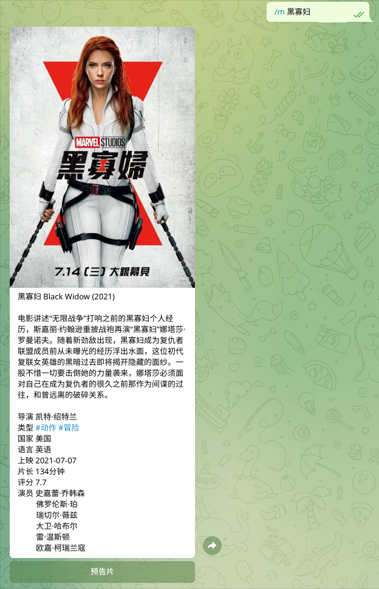
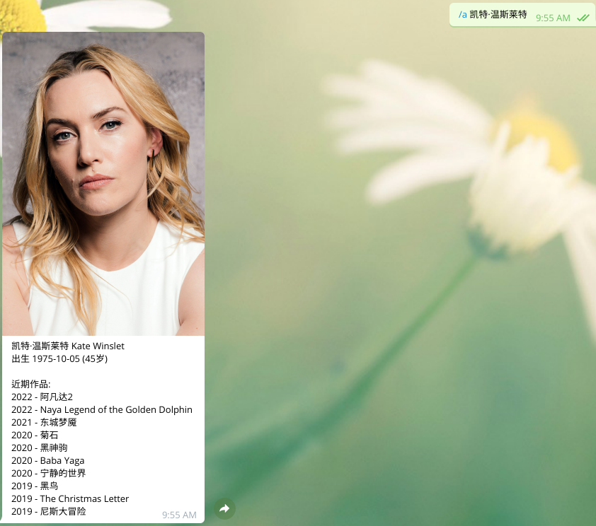

# tmdb-bot
Get Movies/TV Shows and Actors/Directors info from The Movie Database (TMDb) through a Telegram Bot

# Demo

[https://t.me/tmdbzh_bot](https://t.me/tmdbzh_bot) (Simplified Chinese)

# Deploy

1. clone the repo
2. pip3 install -r requirements.txt
3. copy tmdb-bot.service to systemd units location (e.g. `/etc/systemd/system`), modify it with proper environment values and path, then start the service.

# Note

This project currently only supports Simplified Chinese (zh-CN). Pull requests are welcome for multilingual support.
